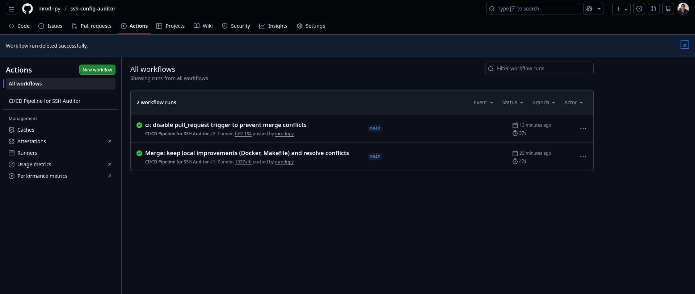

# 🔐 SSH Configuration Auditor & Hardening Tool

[](https://www.python.org/)
[](LICENSE)
[](https://github.com/mrodripy/ssh-config-auditor/issues)

Herramienta profesional en Python para auditar y asegurar configuraciones SSH (`sshd_config`) contra benchmarks de seguridad CIS. Detecta vulnerabilidades críticas como `PermitRootLogin yes` y `PasswordAuthentication yes`, generando reportes claros de cumplimiento.

**Proyecto en dos fases:** Auditoría automatizada (✓ Completado) → Contenerización con Docker (🚧 En progreso).

## ✨ Características

- ✅ **Auditoría automática** de archivos de configuración SSH
- ✅ **Comparación contra baseline CIS/NIST** personalizable
- ✅ **Detección de configuraciones críticas**: `PermitRootLogin`, `Protocol 1`, contraseñas vacías
- ✅ **Reportes múltiples**: Texto claro y JSON para integración
- ✅ **Clasificación por severidad**: HIGH, MEDIUM, LOW
- ✅ **Fácil de extender**: Arquitectura modular para nuevas reglas
- ✅ **Pruebas unitarias**: Cobertura para funcionalidad principal

## 📸 Demostración Rápida
## ✅ CI/CD Status

Nuestro pipeline de integración continua se ejecuta automáticamente en cada commit:


### Ejecución Básica
```bash
python src/ssh_audit.py samples/insecure_sshd_config
[+] Baseline cargado: 12 reglas de seguridad
[+] Auditing: samples/insecure_sshd_config
[+] Auditoría completada: 12 hallazgos

Reporte de Ejemplo
text

============================================================
SSH CONFIGURATION AUDIT REPORT
============================================================
✅ Protocol: Expected='2', Actual='2' | Status: COMPLIANT (LOW)
❌ PermitRootLogin: Expected='no', Actual='yes' | Status: NON_COMPLIANT (HIGH)
❌ PasswordAuthentication: Expected='no', Actual='yes' | Status: NON_COMPLIANT (HIGH)
...
============================================================
SUMMARY
============================================================
Total Rules Checked: 12
✅ Compliant: 2
❌ Non-Compliant: 6
🔶 Not Set (Missing): 4

🚀 Comenzando
Prerrequisitos

    Python 3.8 o superior

    Git (para clonación)

Instalación Rápida
bash

# 1. Clona el repositorio
git clone https://github.com/mrodripy/ssh-config-auditor.git
cd ssh-config-auditor

# 2. Prueba inmediatamente
python src/ssh_audit.py samples/insecure_sshd_config

📖 Uso
Auditoría Básica
bash

# Usa el baseline por defecto (CIS)
python src/ssh_audit.py /etc/ssh/sshd_config

# Especifica un archivo de configuración personalizado
python src/ssh_audit.py /ruta/a/mi_ssh.conf -b configs/mi_baseline.conf

Opciones de Reporte
bash

# Formato JSON para integración con otras herramientas
python src/ssh_audit.py samples/insecure_sshd_config -o json

# Guardar reporte en archivo
python src/ssh_audit.py samples/insecure_sshd_config -f reporte_seguridad.txt

Ayuda Completa
bash

python src/ssh_audit.py --help

📁 Estructura del Proyecto
text

ssh-config-auditor/
├── src/                    # Código fuente principal
│   ├── ssh_audit.py       # Clase principal del auditor
│   └── __init__.py
├── tests/                  # Pruebas unitarias
│   └── test_basic.py
├── configs/               # Baselines de seguridad
│   └── cis_baseline.conf
├── samples/               # Configuraciones de ejemplo
│   └── insecure_sshd_config
├── docs/                  # Documentación adicional
├── .gitignore
├── requirements.txt
├── LICENSE
└── README.md

🧪 Ejecutar Pruebas
bash

python -m pytest tests/

🤝 Contribuir

¡Las contribuciones son bienvenidas! Por favor, abre un Issue o Pull Request.
📄 Licencia

Distribuido bajo la Licencia MIT.
👨‍💻 Autor

Miguel Rodríguez - GitHub

⭐ Si este proyecto te es útil, ¡dale una estrella en GitHub!
=======
# 🔐 SSH Configuration Auditor & Hardening Tool

[](https://www.python.org/)
[](LICENSE)
[](https://github.com/mrodripy/ssh-config-auditor/issues)

Herramienta profesional en Python para auditar y asegurar configuraciones SSH (`sshd_config`) contra benchmarks de seguridad CIS. Detecta vulnerabilidades críticas como `PermitRootLogin yes` y `PasswordAuthentication yes`, generando reportes claros de cumplimiento.

**Proyecto en dos fases:** Auditoría automatizada (✓ Completado) → Contenerización con Docker (🚧 En progreso).

## ✨ Características

- ✅ **Auditoría automática** de archivos de configuración SSH
- ✅ **Comparación contra baseline CIS/NIST** personalizable
- ✅ **Detección de configuraciones críticas**: `PermitRootLogin`, `Protocol 1`, contraseñas vacías
- ✅ **Reportes múltiples**: Texto claro y JSON para integración
- ✅ **Clasificación por severidad**: HIGH, MEDIUM, LOW
- ✅ **Fácil de extender**: Arquitectura modular para nuevas reglas
- ✅ **Pruebas unitarias**: Cobertura para funcionalidad principal

## 📸 Demostración Rápida

### Ejecución Básica
```bash
python src/ssh_audit.py samples/insecure_sshd_config
[+] Baseline cargado: 12 reglas de seguridad
[+] Auditing: samples/insecure_sshd_config
[+] Auditoría completada: 12 hallazgos

Reporte de Ejemplo
text

============================================================
SSH CONFIGURATION AUDIT REPORT
============================================================
✅ Protocol: Expected='2', Actual='2' | Status: COMPLIANT (LOW)
❌ PermitRootLogin: Expected='no', Actual='yes' | Status: NON_COMPLIANT (HIGH)
❌ PasswordAuthentication: Expected='no', Actual='yes' | Status: NON_COMPLIANT (HIGH)
...
============================================================
SUMMARY
============================================================
Total Rules Checked: 12
✅ Compliant: 2
❌ Non-Compliant: 6
🔶 Not Set (Missing): 4

🚀 Comenzando
Prerrequisitos

    Python 3.8 o superior

    Git (para clonación)

Instalación Rápida
```bash

# 1. Clona el repositorio
git clone https://github.com/mrodripy/ssh-config-auditor.git
cd ssh-config-auditor

# 2. Prueba inmediatamente
python src/ssh_audit.py samples/insecure_sshd_config

📖 Uso
Auditoría Básica
bash

# Usa el baseline por defecto (CIS)
python src/ssh_audit.py /etc/ssh/sshd_config

# Especifica un archivo de configuración personalizado
python src/ssh_audit.py /ruta/a/mi_ssh.conf -b configs/mi_baseline.conf

Opciones de Reporte
bash

# Formato JSON para integración con otras herramientas
python src/ssh_audit.py samples/insecure_sshd_config -o json

# Guardar reporte en archivo
python src/ssh_audit.py samples/insecure_sshd_config -f reporte_seguridad.txt

Ayuda Completa
bash

python src/ssh_audit.py --help

📁 Estructura del Proyecto
text

ssh-config-auditor/
├── src/                    # Código fuente principal
│   ├── ssh_audit.py       # Clase principal del auditor
│   └── __init__.py
├── tests/                  # Pruebas unitarias
│   └── test_basic.py
├── configs/               # Baselines de seguridad
│   └── cis_baseline.conf
├── samples/               # Configuraciones de ejemplo
│   └── insecure_sshd_config
├── docs/                  # Documentación adicional
├── .gitignore
├── requirements.txt
├── LICENSE
└── README.md

🧪 Ejecutar Pruebas
bash

python -m pytest tests/

🤝 Contribuir

¡Las contribuciones son bienvenidas! Por favor, abre un Issue o Pull Request.
📄 Licencia

Distribuido bajo la Licencia MIT.
👨‍💻 Autor

Miguel Rodríguez - GitHub

⭐ Si este proyecto te es útil, ¡dale una estrella en GitHub!

#>>>>>>> c206a8f323494a9051d9a42ed5abc7d5d2fc396e
